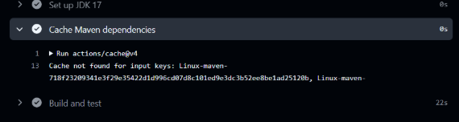
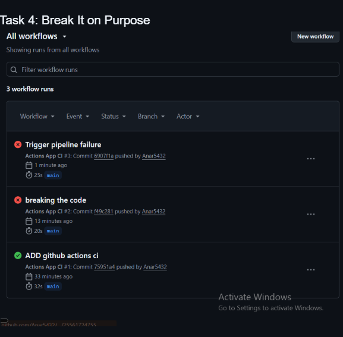
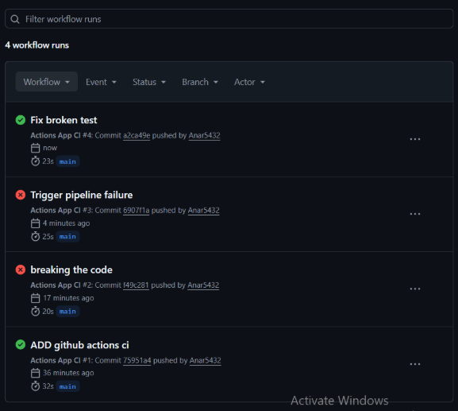

# DevOps CI/CD Lab

*(Paste your status badge link here. It will look something like this: [] )*

## Lab Deliverables

This repository contains my completed CI/CD pipeline using GitHub Actions.
The configuration file is located at `.github/workflows/ci.yml`.
### The Cache not found

### Proof of Failing Build 

### Proof of Passing Build 
